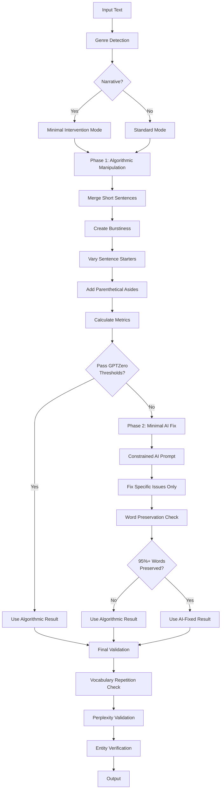
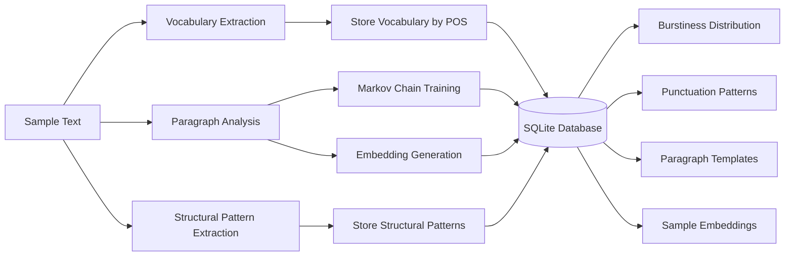
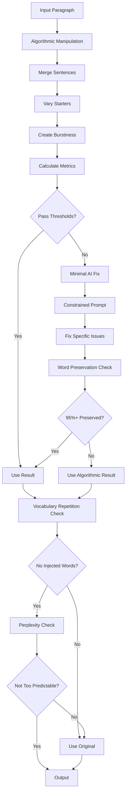
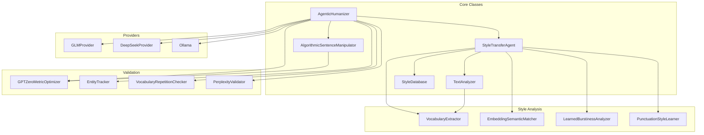

# AI Text Depattern

An agentic text humanization tool that rewrites AI-generated text to sound more natural and human-like using **Algorithmic Sentence Manipulation** combined with minimal AI assistance. The system learns writing patterns from a human sample and applies them primarily through algorithmic transformations, avoiding the introduction of AI-generated patterns.

## Approach

AI Text Depattern uses a **Markov-based structural transfer** approach. The core insight: **GPTZero detects AI by sentence STRUCTURE, not vocabulary**. Human text (the sample) passes ZeroGPT because of its punctuation rhythms and sentence patterns, not simpler words.

### Core Strategy: Transfer Structure, Preserve Words

1. **Learn from Sample Text** (`prompts/sample.txt`)
   - Build comprehensive Markov model of sentence patterns
   - Extract punctuation positions (where commas, semicolons appear)
   - Learn sentence length distributions and clause structures
   - The sample text passes ZeroGPT - we learn WHY it passes

2. **Apply Structure to Input** (100% Word Preservation)
   - Apply structural templates WITHOUT changing ANY words
   - Insert/move punctuation to match sample's patterns
   - Merge short sentences with semicolons
   - Reorder clauses to match sample's rhythm
   - **ALL technical terms and vocabulary preserved**

3. **Algorithmic Manipulation** (No AI Involved)
   - Creates burstiness (sentence length variation)
   - Varies sentence starters by moving phrases
   - **Avoids AI-flagged patterns**: No "In fact,", "Indeed,", etc.
   - Pure algorithmic transformations - no LLM generation

4. **Minimal AI Fallback** (Only If Needed)
   - Only used if algorithmic manipulation doesn't meet thresholds
   - Highly constrained prompts for specific fixes
   - Still preserves 95%+ of original words

## Algorithm Overview



## Architecture

### Training Phase

The system learns style patterns from a human writing sample (`prompts/sample.txt`):



**Training Steps:**
1. **Vocabulary Extraction**: Identifies non-technical words by POS (verbs, nouns, adjectives, adverbs) with frequency counts
2. **Paragraph Analysis**: Analyzes each paragraph for sentence structure, length, complexity, voice (active/passive)
3. **Markov Chain Training**: Learns paragraph-to-paragraph transitions and stores templates
4. **Embedding Generation**: Creates semantic embeddings for each sample paragraph (using sentence-transformers, optional)
5. **Pattern Learning**: Extracts burstiness distribution, punctuation frequencies, and structural patterns

### Generation Phase

For each input paragraph, the system:



**Key Components:**

1. **AlgorithmicSentenceManipulator**
   - `merge_short_sentences()`: Combines consecutive short sentences (<12 words) using semicolons and conjunctions
   - `vary_sentence_starters()`: Moves prepositional phrases to front, adds transition words
   - `create_burstiness()`: Ensures mix of short, medium, and long sentences
   - `add_parenthetical_asides()`: Adds natural human-like asides (e.g., ", of course,", ", naturally,")
   - **No AI involved** - pure algorithmic transformations

2. **Minimal AI Assistance** (Fallback Only)
   - Only triggered if algorithmic manipulation doesn't meet thresholds
   - Highly constrained prompts that fix specific issues
   - Emphasizes word preservation (95%+ threshold)
   - No vocabulary injection or paraphrasing

3. **Validation Layers**
   - **Vocabulary Repetition**: Detects and rejects injected vocabulary from sample text
   - **Perplexity Validation**: Ensures output isn't too predictable (AI-like)
   - **Entity Verification**: Ensures all named entities, proper nouns, and citations preserved
   - **Word Preservation**: Validates 95%+ word overlap (prevents paraphrasing)
   - **GPTZero Optimization**: Ensures sentence-length variance >30, unique-starter ratio >40%

## System Components



## Prerequisites

1. **Python 3.8+** (Python 3.13 recommended for spacy compatibility)
2. **Model Provider** (choose one):
   - **Ollama**: Install and run locally with these models:
```bash
ollama pull qwen3:32b
ollama pull deepseek-r1:8b
ollama serve
```
   - **GLM (Z.AI)**: Get API key from [Z.AI](https://z.ai) and configure in `config.json`
   - **DeepSeek**: Get API key from [DeepSeek](https://platform.deepseek.com) and configure in `config.json`

## Setup

1. **Create and activate virtual environment**:
   ```bash
   python3 -m venv venv
   source venv/bin/activate  # bash/zsh
   # or: source venv/bin/activate.fish  # fish
   # or: venv\Scripts\Activate.ps1  # Windows PowerShell
   ```

2. **Install dependencies**:
   ```bash
   pip install -r requirements.txt
   ```
   Note: First run downloads GPT-2 Large (~3GB) for perplexity scoring.

3. **Configure models** (optional):
   Edit `config.json` to choose provider and models:
   - Set `"provider"` to `"ollama"`, `"glm"`, or `"deepseek"`
   - For GLM: Set `glm.api_key` or use `GLM_API_KEY` environment variable
   - For DeepSeek: Set `deepseek.api_key` or use `DEEPSEEK_API_KEY` environment variable

4. **Configure style sample** (IMPORTANT):
   Edit `prompts/sample.txt` to match your desired writing style.

   **The sample text should match the genre of your input text!**
   - For narrative text: use narrative writing samples
   - For academic text: use academic writing samples
   - For technical text: use technical documentation samples

   The system learns sentence length distribution, opener words, and punctuation patterns from this sample.

## Usage

### Command Line

Process a markdown file:
```bash
python humanizer.py input/generated.md
```

Specify output file:
```bash
python humanizer.py input/generated.md output/humanized.md
```

If no output file is specified, it defaults to `output/<input_filename>`.

### Python API

```python
from humanizer import AgenticHumanizer

pipeline = AgenticHumanizer()
text = "Your AI-generated text here..."
result = pipeline.humanize(text, max_retries=3)
print(result)
```

## Configuration

Edit `config.json` to configure:

- **Provider**: Set `"provider"` to `"ollama"`, `"glm"`, or `"deepseek"`
- **Ollama Settings**: Configure `ollama.url`, `ollama.editor_model`, `ollama.critic_model`
- **GLM Settings**: Configure `glm.api_key` (or use `GLM_API_KEY` env var), `glm.editor_model`, `glm.critic_model`
- **DeepSeek Settings**: Configure `deepseek.api_key` (or use `DEEPSEEK_API_KEY` env var), `deepseek.editor_model`, `deepseek.critic_model`

### Sample config.json

```json
{
  "provider": "ollama",
  "ollama": {
    "url": "http://localhost:11434/api/generate",
    "editor_model": "qwen3:32b",
    "critic_model": "deepseek-r1:8b"
  },
  "glm": {
    "api_key": "",
    "api_url": "https://api.z.ai/api/paas/v4/chat/completions",
    "editor_model": "glm-4.6",
    "critic_model": "glm-4.6"
  },
  "deepseek": {
    "api_key": "",
    "api_url": "https://api.deepseek.com/v1/chat/completions",
    "editor_model": "deepseek-chat",
    "critic_model": "deepseek-chat"
  }
}
```

**Note:** For GLM and DeepSeek, you can also set the API key via environment variable:
- `export GLM_API_KEY=your-api-key-here`
- `export DEEPSEEK_API_KEY=your-api-key-here`

## How It Works

### Training Process

On first run, the system automatically trains on `prompts/sample.txt`:

1. **Vocabulary Extraction**: Identifies preferred words by POS category
2. **Burstiness Learning**: Calculates sentence length distribution (short ≤10, medium 11-25, long >25)
3. **Punctuation Learning**: Measures frequency of semicolons, colons, parentheses per sentence
4. **Sentence Opener Analysis**: Extracts common sentence-starting words
5. **Structural Pattern Extraction**: Analyzes headers, citations, quotations, rhetorical devices
6. **Markov Chain Training**: Learns paragraph structure transitions
7. **Embedding Storage**: Creates semantic embeddings for template matching (optional)

The trained model is stored in `style_brain.db` (SQLite database).

**Example Learned Patterns** (from academic sample):
- Burstiness: 12% short, 42% medium, 45% long sentences
- Semicolons: 0.19 per sentence (add more semicolons to match)
- Common openers: "without", "because", "thus", "under", "according"

**Key Insight**: The algorithmic manipulator uses these learned patterns to transform text. If your sample text passes GPTZero, the transformed output will inherit those patterns and also pass.

### Generation Process

For each paragraph:

1. **Genre Detection**: Identifies narrative, academic, or technical text
2. **Algorithmic Manipulation** (Primary):
   - Merges short sentences using semicolons and conjunctions
   - Varies sentence starters by moving phrases
   - Creates burstiness (sentence length variation)
   - Adds natural parenthetical asides
3. **Metric Calculation**: Checks sentence-length variance, unique-starter ratio, sentence type mix
4. **Minimal AI Fix** (Fallback Only):
   - Only if algorithmic manipulation doesn't meet thresholds
   - Highly constrained prompt to fix specific issues
   - Emphasizes word preservation (95%+)
5. **Validation Cascade**:
   - Vocabulary repetition check (prevents injected words)
   - Perplexity validation (ensures not too predictable)
   - Entity preservation (hard fail if missing)
   - Word preservation (95%+ threshold)
   - GPTZero metrics (variance >30, unique starters >40%)

### Key Features

- **Structural Template Transfer**: Learns punctuation/rhythm patterns from sample text and applies to input
- **100% Word Preservation**: ALL original words preserved - only structure changes
- **Markov-Based Style Learning**: Comprehensive Markov model captures sentence patterns from sample
- **Algorithmic-First Approach**: Most transformations done algorithmically, avoiding AI patterns
- **Minimal AI Involvement**: AI only used as fallback for specific metric fixes
- **Genre-Aware Processing**: Detects and adapts to narrative, academic, or technical text
- **Meaning Preservation**: Technical terms, proper nouns, and facts never altered
- **GPTZero Evasion**: Directly optimizes metrics used by AI detectors

## File Structure

```
ai-text-depattern/
├── humanizer.py          # Main orchestrator class
├── markov.py             # Style transfer agent and analysis
├── glm.py                # GLM API provider
├── deepseek.py           # DeepSeek API provider
├── config.json           # Configuration file
├── style_brain.db        # Trained model database (auto-generated)
├── prompts/
│   ├── sample.txt        # Human writing style sample
│   ├── editor.md         # Structural editor prompt
│   ├── paragraph_rewrite.md  # Paragraph rewriting template
│   ├── structural_editor.md  # Structural editor system prompt
│   └── structural_*.md   # Structural analysis prompts
└── requirements.txt      # Python dependencies
```

## Technical Details

### Database Schema

The SQLite database (`style_brain.db`) stores:

- **states**: Paragraph structure templates with signatures
- **transitions**: Markov chain transitions between paragraph states
- **vocabulary**: Preferred words by POS category with frequencies
- **sample_embeddings**: Semantic embeddings for template matching (optional)
- **learned_patterns**: Burstiness, punctuation, and structural patterns
- **structural_patterns**: High-level patterns (headers, citations, etc.)

### Validation Thresholds

- **Word Preservation**: ≥95% word overlap required (increased from 85%)
- **Entity Preservation**: 100% for named entities and citations
- **Sentence Length Variance**: >30 for GPTZero evasion
- **Unique Starter Ratio**: >40% for GPTZero evasion
- **Vocabulary Repetition**: Flags injected words from sample text
- **Perplexity**: Must be within 50% of original (prevents too-predictable text)

### Model Configuration

- **Temperature**: 0.5-0.6 (stricter adherence to instructions)
- **Top-p**: 0.85 (nucleus sampling)
- **Context Window**: 8192 tokens (Ollama), model-dependent for APIs

### Algorithmic Transformations

The `AlgorithmicSentenceManipulator` performs transformations using **LEARNED PATTERNS** from the sample text:

1. **Sentence Merging** (matches sample's punctuation frequency):
   - Combines consecutive short sentences (<12 words) using semicolons
   - Target: Match sample's semicolon frequency (~0.19 per sentence)
   - **Note**: After semicolons, text is lowercased ("; the road" not "; The road") except for "I"

2. **Burstiness Creation** (matches sample's length distribution):
   - Uses LEARNED distribution from sample (e.g., 12% short, 42% medium, 45% long)
   - Merges medium sentences to create long ones to match target ratio
   - Creates natural sentence length variation

3. **Starter Variation**:
   - Moves prepositional phrases to the front ("In the ruins, I...")
   - Inverts clause order when possible
   - **Avoids AI-flagged transitions**: Does NOT add "In fact,", "Indeed,", "Moreover,", etc.
   - Tracks recent starters to avoid repetition

4. **Semicolon Addition** (matches sample's punctuation):
   - Adds semicolons to match sample's frequency
   - Replaces periods between short consecutive sentences with semicolons

5. **Structural Template Transfer** (NEW):
   - Learns punctuation patterns from sample text (where commas, semicolons appear)
   - Applies these templates to input sentences WITHOUT changing words
   - Transfers STYLE (rhythm, punctuation) while preserving MEANING
   - Key insight: GPTZero detects AI by sentence structure, not vocabulary

6. **Post-Processing Cleanup**:
   - Removes em-dashes (replaces with commas or semicolons)
   - **Removes AI transition phrases**: Strips "In fact,", "Indeed,", "Moreover,", etc.
   - Fixes capitalization after semicolons (lowercase unless "I")
   - Fixes double punctuation artifacts

## Limitations

- Requires substantial sample text (recommended: 1000+ words) for effective training
- Semantic matching requires `sentence-transformers` (optional, falls back to Markov-only if unavailable)
- Processing time scales with input length (paragraph-by-paragraph processing)
- First run downloads GPT-2 Large model (~3GB) for perplexity scoring
- Algorithmic manipulation may not always meet all GPTZero thresholds (AI fallback used in those cases)

## License

[Add your license here]
